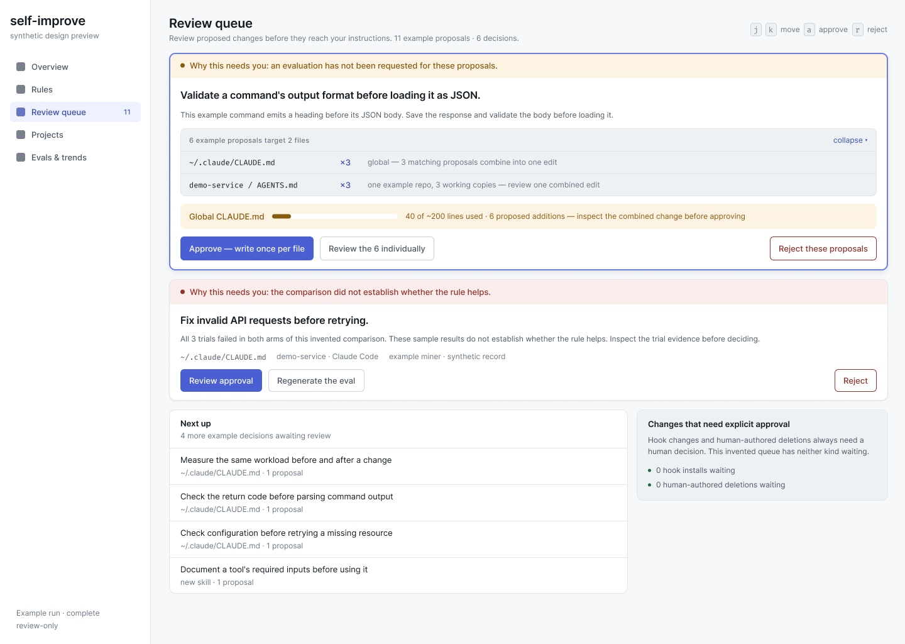
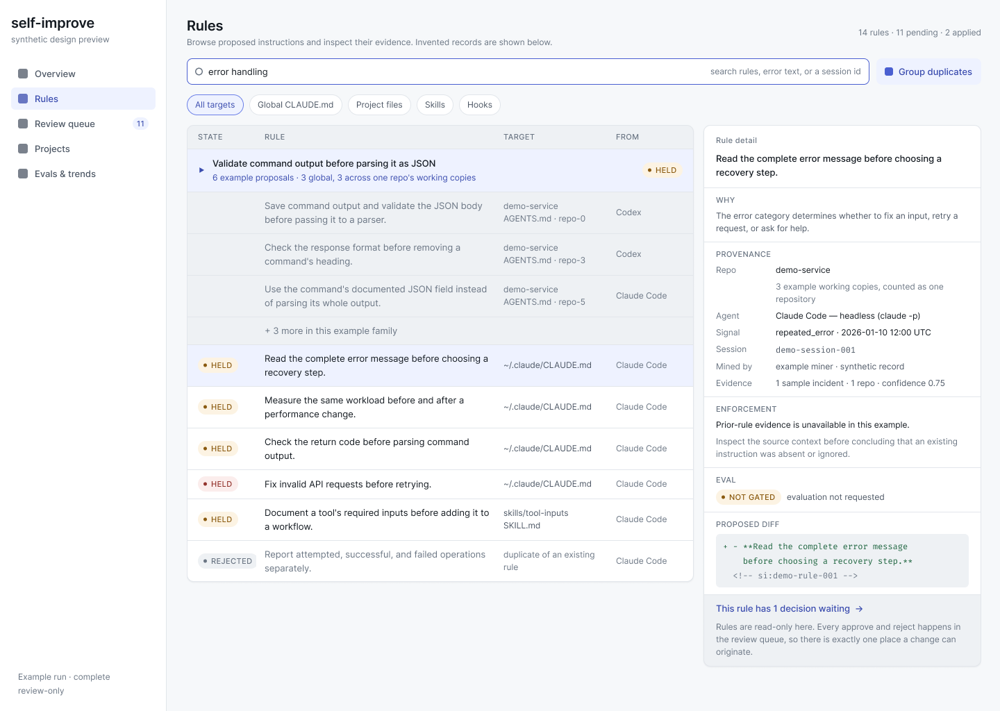

# recursive-self-improve

**A research preview for turning recurring coding-agent mistakes into reviewable instruction changes.**

The tool reads saved Claude Code and Codex sessions, identifies mistakes and
corrections, and proposes changes to agent instructions. A local dashboard lets
you inspect runs, rules, evidence and proposed edits. The research question is
whether feedback from earlier agent work can improve instructions for later work.
No general improvement rate is claimed.



*Review queue — native Figma design export with invented examples. Screenshots
show the intended interface, not proof that every depicted feature is implemented.
See [preview scope](docs/RESEARCH_PREVIEW.md).*

## Try it without personal history

Install Python 3.12 or newer, Git and [uv](https://docs.astral.sh/uv/). Then:

```sh
uv sync --extra dashboard --frozen
uv run python examples/dashboard_demo.py
```

Open **http://127.0.0.1:8876**. The real dashboard uses an invented dataset in a
temporary directory. It makes no model calls and reads no personal history.
Decisions affect only that disposable database. Stop with Ctrl-C; the next
launch starts fresh.

The separate retrieval demo uses the pinned public embedding model:

```sh
uv run selfimprove eval-retrieval --synthetic --json
```

The first retrieval run downloads the model; embedding then runs locally.
Synthetic scores exercise the harness and do not establish real-history quality.
See [installation and package checks](docs/DISTRIBUTION.md).

## Supported workflow

The latest preview adds a dedicated Project page, recorded instruction inventories,
per-copy rule availability, monthly signal trends, and complete evaluation history.
Evaluation details retain the frozen rule, scenarios, trial outcomes, and served
models. These records support inspection without claiming real-world improvement.
Existing installations need the [database upgrade](docs/UPGRADING.md).

Inspect runs, rules and evidence; review the exact proposed revision; approve it;
run the instruction worker explicitly; inspect its result; and request a
conflict-aware rollback. Scoped rejection can suppress one target or a lesson.
Automatic classes start off. Review decisions alone do not write instruction files.



*Rules browser — native Figma design export with invented examples.*

[The workflow guide](docs/WORKFLOW.md) explains explicit delivery, stale previews,
retries, rejection and rollback. Project delivery may create a commit on its
recorded delivery branch rather than change the checked-out file.

## Use your own sessions deliberately

The complete mining workflow is experimental and primarily exercised on macOS.
It needs authenticated provider CLIs and their configured permissions, the quota
router and, for configured evaluation trials, a sandbox runtime. Review
[configuration](src/self_improve/config.py) and use an explicit private config.

```sh
uv run selfimprove --help
uv run selfimprove --config /absolute/private/config.toml run --review-only
uv run selfimprove --config /absolute/private/config.toml dashboard
```

A review-only run reads configured histories, spends model calls and writes local
state, while holding instruction changes. The regular dashboard binds to
**127.0.0.1:8765** and has no authentication. Do not expose it to a network.

`run --dry-run` also writes scan and incident state. It is not a read-only rehearsal.
This preview does not install unattended services or enable automatic classes.

## Boundaries and limits

Real corpus text, judgments, labels and operational backups stay outside Git.
Missing private benchmarks fail instead of falling back to synthetic data.
Redaction does not establish that transcript text is safe to share. Mining may
send redacted content to a provider. A bounded model request does not itself
disable provider tools; prompts are not an enforced permission boundary.

The selected workflow is verified with invented histories and stubbed provider
responses. That scope does not establish real-provider effectiveness. Full
diagnosis, session receipt, benefit metrics, quality assessments, policy controls,
and full Figma parity remain [backlog](docs/RESEARCH_PREVIEW.md).

## Develop and inspect

- [Contributing](CONTRIBUTING.md): setup, tests and CI.
- [Data boundary](docs/DATA_BOUNDARY.md): private exports and reproduction.
- [Embedding identity](docs/EMBEDDING_MODELS.md): frozen model inputs.
- [Runbook](docs/RUNBOOK.md): deliberate local operations.
- [Security](SECURITY.md): reporting and execution limits.
- [Screenshot provenance](docs/images/README.md): reviewed native exports.
- [Pipeline](src/self_improve/pipeline.py), [worker](src/self_improve/worker.py),
  and [apply/rollback](src/self_improve/apply.py): runtime entry points.

## License

[MIT](LICENSE), copyright (c) 2026 Tony Wu. Bundled fonts retain their
[third-party notices](src/self_improve/dashboard/static/fonts/manifest.json).
